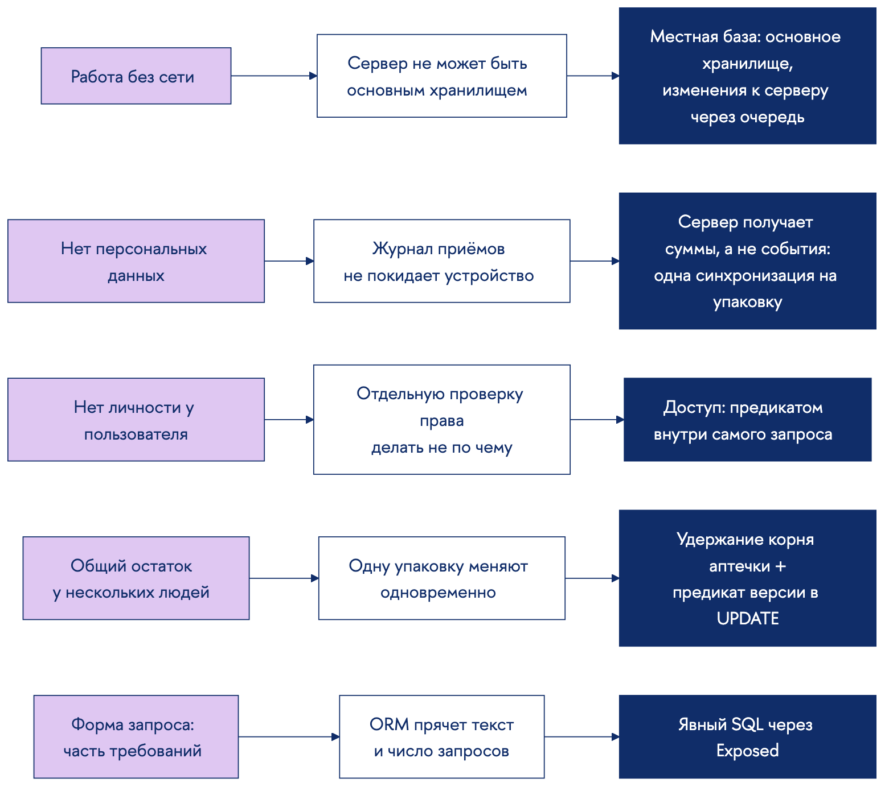
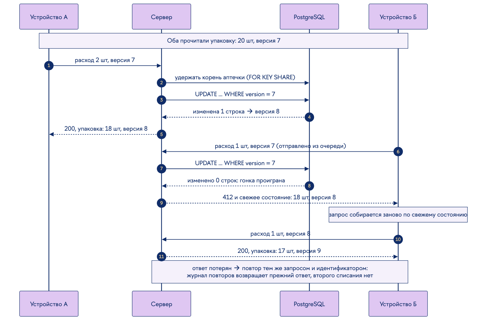
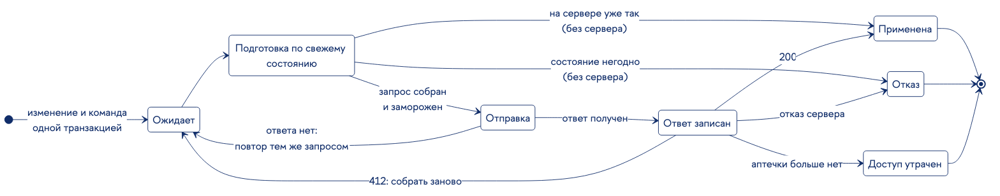
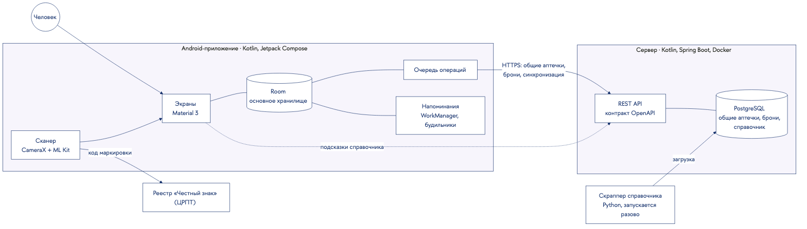
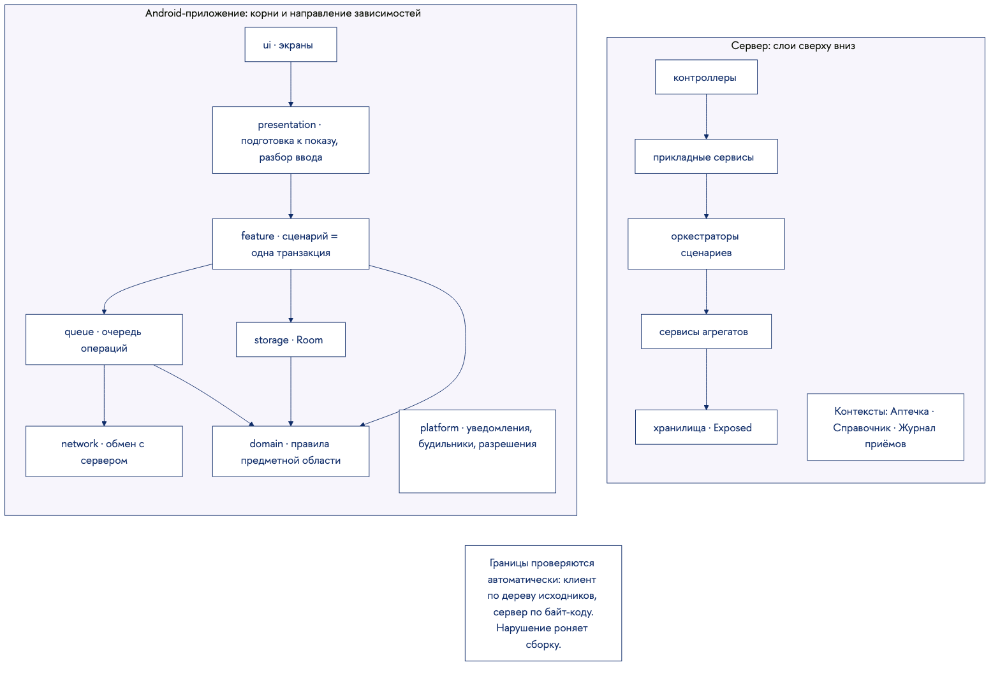

# Текст выступления к защите: полный вариант

**Проект:** Приложение для Android «Органайзер лекарств» (MedApp)

Это основательный текст: в нём всё, что стоит сказать о проекте, без ограничения по времени. Из
него собирается регламентный текст (`Текст выступления (регламент).md`), а затем итоговый.

Каждый раздел соответствует пункту методички и устроен одинаково:

- **Главное**: то, что должно остаться в регламентном тексте;
- **Расширение**: то, что добавляется при запасе времени или пригодится в ответах;
- **На слайде**: какая информация видна и в какой форме. Пометка *(показывается)* означает, что
  материал виден на слайде, но не проговаривается; *(подробно)* означает, что в речи он
  раскрывается.

Черновики инфографики лежат в `infographics/` (исходники mermaid и `databases.py`, сборка
`render.sh`).

---

## 1. Титульный слайд

**Главное.**
Добрый день. Тема индивидуального программного проекта: приложение для Android «Органайзер
лекарств». Работу выполнил студент группы БПИ245 Никита Волошин, научный руководитель: кандидат
экономических наук, доцент департамента программной инженерии Елена Юрьевна Песоцкая.

**На слайде.**
- Название на русском: «Приложение для Android „Органайзер лекарств“».
- Название на английском: “Medicine Organizer” Android Application.
- Вид и тип: индивидуальный, программный.
- Исполнитель: Волошин Никита, БПИ245.
- Руководитель: Е. Ю. Песоцкая, к. э. н., доцент департамента программной инженерии ФКН НИУ ВШЭ.
- Москва, 2026.

---

## 2. Описание предметной области

**Главное.**
Предметная область: учёт домашних лекарственных средств. В ней есть места хранения, упаковки с
остатком и сроком годности, курсы лечения по расписанию и приёмы, которые списывают препарат.

Единицей учёта выбрана физическая упаковка, а не лекарство вообще. Две пачки одного препарата
почти всегда имеют разный срок годности, а «одно лекарство» определить нечем: действующее
вещество, торговое название, комплектация и производитель дают четыре несовпадающих ответа.
Поэтому приём списывает дозу из конкретной упаковки, а курс лечения хранит список
упаковок-источников и порядок их расходования.

**Расширение.**
Программа не назначает и не контролирует лечение. Она организует сведения и напоминает, поэтому
медицинским изделием не является.

**На слайде.**
- Диаграмма классов предметной области *(подробно)*: аптечка, упаковка, бронь, курс лечения,
  источник курса, приём. Кратности показывают главное: приём списывает из одной упаковки, курс
  берёт дозы из нескольких упаковок в заданном порядке.
- Подпись: «единица учёта: физическая упаковка».

---

## 3. Актуальность работы

**Главное.**
Лекарства обычно хранятся в нескольких местах: дома, на даче, в дороге. Курс лечения идёт по
расписанию, и без записи трудно установить, был ли приём. Одной аптечкой часто пользуются
несколько человек, поэтому остаток меняется без ведома того, кто рассчитывает на препарат для
своего курса.

Существующие приложения решают эти задачи по отдельности: одни напоминают о приёме, другие ведут
список упаковок. Учёт, расписание и общий запас в одном приложении не собраны.

**Расширение.**
По оценке Всемирной организации здравоохранения, около половины пациентов с хроническими
заболеваниями принимают лекарства не так, как предписано; одна из частых причин бытовая:
пропущенный приём или вовремя не пополненный запас.

**На слайде.**
- Три ситуации короткими строками: несколько мест хранения; курс по расписанию; общая аптечка.
- Вывод строкой: задачи решаются разными приложениями, единого решения нет.
- Сноска: ВОЗ, «Adherence to long-term therapies», 2003 *(показывается)*.

---

## 4. Цель и задачи работы

**Главное.**
Цель: разработать приложение для Android, которое ведёт учёт домашних аптечек, планирует приём
лекарств и напоминает о нём, а также позволяет нескольким людям согласованно пользоваться одной
аптечкой.

Задачи перечислены на слайде. Отдельно стоит отметить, что для этой цели понадобились сервер
общих аптечек и справочник препаратов: без них общий запас и подсказки при вводе невозможны.

**На слайде** *(показывается)*.
Цель одной фразой и задачи списком:
1. Проанализировать предметную область и существующие решения.
2. Сформулировать требования и согласовать техническое задание.
3. Выбрать методы согласования общего остатка, работы без сети и разграничения доступа.
4. Спроектировать архитектуру и модель данных клиента и сервера.
5. Собрать справочник лекарственных препаратов, продающихся в РФ.
6. Разработать серверную часть: общие аптечки, брони, конкурентные изменения.
7. Разработать Android-приложение: учёт, курсы, напоминания, сканирование, отчёты.
8. Провести испытания и подготовить документацию по ГОСТ 19.

---

## 5. Анализ существующих решений (аналогов)

**Главное.**
Для сравнения взяты пять приложений. Medisafe и MyTherapy напоминают о приёме. «Домашняя
аптечка» и «Аптечка. Учёт медикаментов» ведут список упаковок и сроки годности. «Честный ЗНАК»
распознаёт код маркировки.

Напоминания, учёт остатка и сроки есть почти у всех. Отличия в трёх местах. Общего остатка,
который расходуют несколько человек с разных устройств, нет ни у кого: семейные профили Medisafe
и MyTherapy дают каждому человеку свой список. Брони остатка под курс лечения тоже нет ни у кого.
И все приложения с общими данными требуют учётную запись.

**На слайде.**
- Таблица «возможность × приложение» с авторами под названиями *(показывается; в речи только
  вывод)*:

| Возможность | Medisafe (Medisafe Inc.) | MyTherapy (smartpatient GmbH) | «Домашняя аптечка» (pewaru-333, открытый код) | «Аптечка. Учёт медикаментов» (DecSoft) | «Честный ЗНАК» (ЦРПТ) | MedApp |
|---|---|---|---|---|---|---|
| Напоминания о приёме | + | + | + | + | + | + |
| Учёт остатка упаковки | + | + | + | + | – | + |
| Несколько мест хранения | – | – | – | + | – | + |
| Контроль сроков годности | – | – | + | + | + | + |
| Сканирование кода маркировки | – | – | + | + | + | + |
| Справочник препаратов РФ | – | – | + | – | + | + |
| Общая аптечка с общим остатком | – | – | – | – | – | + |
| Бронь остатка под курс лечения | – | – | – | – | – | + |
| Полная работа без сети | – | + | + | + | – | + |
| Без учётной записи и персональных данных | – | – | – | – | – | + |

- Подпись: «по открытым описаниям, сентябрь 2026 г.».
- Строки «общий остаток» и «бронь» выделены: это предмет работы.

---

## 6. Функциональные требования (и сценарии работы)

**Главное.**
Требования технического задания сведены на слайде в перечень с номерами пунктов. Подробно стоит
остановиться на трёх, потому что они определили устройство программы.

Первое: бронь под курс в общей аптечке. Курс лечения закрепляет за собой часть общего остатка, и
другой участник не может израсходовать её, не получив предупреждения.

Второе: конфликт остатка с курсом. Если остатка стало меньше, чем нужно курсу, план приёмов не
меняется, а число обеспеченных приёмов сокращается, и человек получает уведомление.

Третье: просроченный препарат не удаляется и не блокируется. Он выделяется, поднимается в списке
первым и остаётся в аптечке до решения человека.

Два нефункциональных требования проходят через всю систему: работа без сети и отказ от
персональных данных.

Основной сценарий работы показан на схеме: учётная запись создаётся устройством без ввода
логина; упаковка заводится вручную с подсказкой справочника или сканированием кода маркировки;
курс лечения получает источники и порядок их расходования; напоминание приходит в назначенное
время, и ответ списывает дозу из конкретной упаковки. Параллельно аптечка становится общей по
приглашению, и участник бронирует остаток под свой курс.

**Расширение.**
Требования ТЗ записаны от заказчика. Например, «истрачено» задано формулой «всё добавленное минус
всё оставшееся». Такая формула сочла бы расходом перенос упаковки и чужой приём в общей аптечке,
поэтому отчёт считается по состоявшимся приёмам. Это та же величина, посчитанная без ошибки.

**На слайде.**
- Формализованный перечень требований *(показывается целиком; подробно только ФТ-5, ФТ-7, ФТ-8)*:

| № | Требование | Пункт ТЗ |
|---|---|---|
| ФТ-1 | Учёт упаковок: обязательные поля (название, форма, количество, срок годности, аптечка) и необязательные (доза, цена, даты, производитель, заметка) | 4.1.1.1, 4.1.1.3 |
| ФТ-2 | Управление аптечками: создание, переименование, удаление с переносом или уничтожением содержимого | 4.1.1.2 |
| ФТ-3 | Заведение упаковки вручную с подсказками справочника и сканированием кода маркировки | 4.1.1.3.1, 4.1.1.3.2, 4.1.1.12 |
| ФТ-4 | Курс лечения: доза, дата начала, дни недели, время приёмов; правка без изменения прошлых приёмов | 4.1.1.4.4 |
| ФТ-5 | Напоминания и ответ по каждому приёму; ответ корректирует остаток конкретной упаковки | 4.1.1.4.4.6, 4.1.1.4.4.7 |
| ФТ-6 | Однократный приём вне курса | 4.1.1.4.3 |
| ФТ-7 | Просроченный препарат выделяется, остаётся до ручного удаления, о сроке приходит уведомление | 4.1.1.5 |
| ФТ-8 | Общая аптечка: приглашение QR или кодом, бронь под курс, предупреждение при расходе чужой брони | 4.1.1.11 |
| ФТ-9 | Разрешение конфликтов остатка с курсами и уведомление о сокращении обеспечения | 4.1.1.13 |
| ФТ-10 | Поиск по аптечке и по всем аптечкам, фильтрация и сортировка в любом порядке | 4.1.1.6–4.1.1.9 |
| ФТ-11 | Отчёты: сводка, расход до даты (до 3 месяцев), истрачено за период (до года), план на дату | 4.1.1.10 |
| НФТ-1 | Работа без сети; синхронизация общих аптечек при появлении связи | 3.2.3, 4.3 |
| НФТ-2 | Нет персональных данных: идентификация по сгенерированному идентификатору | 4.6.4 |
| НФТ-3 | Отказоустойчивость: нет аварийного завершения при любом вводе и сбоях сети | 4.3 |
| НФТ-4 | Android 10+, Kotlin и Jetpack Compose; сервер REST с описанием OpenAPI | 4.5, 4.6.3, 4.6.5 |

- Схема сценария работы *(подробно)*:

---

## 7. Анализ существующих подходов

**Главное.**
Три требования проекта (общий остаток, работа без сети, отсутствие персональных данных) упираются
в известные задачи, и у каждой есть устоявшиеся подходы.

Согласование общего остатка. Правило «последняя запись побеждает» теряет чужой расход. Журнал
событий на сервере потребовал бы передавать серверу каждый приём. Слияние на клиентах без
сервера не может запретить остатку уйти ниже чужой брони. Остаётся сервер как источник истины по
остатку с проверкой версий.

Работа без сети. Приложение «только онлайн» противоречит требованию. Кэш при сервере как
основном хранилище не подходит для местных аптечек, которые серверу вообще не нужны. Подходит
местная база как основное хранилище и очередь изменений к серверу.

Разграничение доступа. Отдельная проверка права перед операцией требует знать о пользователе
больше и оставляет промежуток между проверкой и чтением. Политики строк в самой базе возможны,
но переносят правило из кода в конфигурацию базы. Третий вариант: условие доступа внутри каждого
запроса.

**Расширение.**
Доступ к базе. Объектно-реляционное отображение (JPA и Hibernate) строит запросы само и прячет их
текст и число. Явный SQL оставляет запрос видимым в коде.

Идентификация. Логин, почта и пароль сами являются персональными данными. Альтернатива: ключ,
созданный устройством.

**На слайде.**
- Таблица «задача → подходы → чем не подошёл» *(показывается; в речи по одной фразе на
  задачу)*:

| Задача | Подход | Оценка для проекта |
|---|---|---|
| Согласование общего остатка | последняя запись побеждает | теряет чужой расход |
| | журнал событий на сервере | серверу пришлось бы знать каждый приём |
| | слияние на клиентах без сервера | не удержать остаток выше чужой брони |
| | **сервер как источник истины + версии** | **выбран** |
| Работа без сети | только онлайн | противоречит требованию |
| | кэш при серверном хранилище | местные аптечки серверу не нужны |
| | **местная база + очередь изменений** | **выбран** |
| Разграничение доступа | отдельная проверка права | лишний запрос и окно между проверкой и чтением |
| | политики строк в базе | оставлено как второй рубеж (развитие) |
| | **условие доступа внутри запроса** | **выбран** |
| Доступ к БД | ORM (JPA, Hibernate) | прячет форму и число запросов |
| | **явный SQL (Exposed)** | **выбран** |
| Идентификация | логин, почта, пароль | персональные данные |
| | **ключ, созданный устройством** | **выбран** |

---

## 8. Выбор используемых методов

**Главное.**
Каждый выбор выводится из требования. Работа без сети означает, что основным хранилищем является
местная база, а изменения идут к серверу через очередь. Отказ от персональных данных означает,
что журнал приёмов не покидает устройство. Сервер получает не события, а итог по упаковке:
расход и бронь одним запросом. У сервера нет пользователя как личности, поэтому доступ
проверяется не отдельным шагом, а условием внутри запроса. Общий остаток меняют одновременно,
поэтому команда удерживает корневую строку аптечки, а версия проверяется в самом запросе
изменения. Форма запроса сама стала требованием, поэтому запросы пишутся явно.

**На слайде.**
- Цепочки «требование → ограничение → метод» *(подробно; это визуальная версия речи)*:

---

## 9. Описание разработанного метода

**Главное.**
Разработанный метод согласования общего остатка состоит из двух половин: клиентской и серверной.

На клиенте изменение и команда к серверу записываются одной транзакцией. В очередь попадает не
намерение отправить, а факт вместе с его причиной. Перед отправкой команда собирается заново по
свежему состоянию упаковки. Исходов три: запрос уходит; операция закрывается отказом, не
обращаясь к серверу, если состояние для неё уже негодно; операция закрывается применённой, если
на сервере уже то, чего она добивалась. Собранный запрос замораживается. Повтор после обрыва идёт
тем же телом и тем же идентификатором, иначе потерянный ответ превратился бы во второе списание.
Ответ сервера сначала записывается, потом применяется.

На сервере команда удерживает корневую строку аптечки и под удержанием перечитывает то, что
меняет. Версия проверяется условием в самом UPDATE: ноль изменённых строк означает, что гонку
проиграли. Клиент получает 412 и свежее состояние, собирает запрос заново и повторяет.

На схеме: устройство А списывает две штуки с версии 7 и получает версию 8. Устройство Б
отправляет своё списание из очереди с той же версией 7, получает отказ и свежее состояние,
пересобирает запрос от версии 8 и получает версию 9.

**Расширение.**
- Синхронизация выполняется одним атомарным запросом на упаковку. Расход и бронь являются двумя
  состояниями одной упаковки, и порядок двух отдельных запросов не гарантирован: пришедший первым
  расход вызвал бы ложное предупреждение «лекарства мало». Расход передаётся приращением, потому
  что он коммутативен; бронь передаётся абсолютным значением, потому что это решение владельца.
- Журнал повторов пишется после фиксации транзакции и спрашивается раньше проверки версии.
  Поэтому повтор потерянного ответа получает прежний ответ, а не отказ по версии.
- Режимы удержания два. Исключительный берут вступление, выход, удаление аптечки и перенос
  упаковки; совместимый берут все остальные команды записи. Две аптечки удерживаются в
  устойчивом порядке, иначе встречные переносы дали бы взаимную блокировку.
- Тонкость PostgreSQL: блокирующий запрос берёт снимок до ожидания, поэтому присоединённая строка
  членства приходит устаревшей. Членство проверяется вторым запросом.
- Коды ответов различают исходы: 428 версия не прислана, 412 версия устарела, 404 недоступно или
  не существует, 409 повторное вступление или дубль.

**На слайде.**
- Диаграмма последовательности гонки двух устройств *(подробно)*:

- Диаграмма состояний операции очереди *(подробно или отдельным слайдом)*:

---

## 10. Архитектура приложения

**Главное.**
Система состоит из трёх частей, у каждой своя причина меняться. Android-приложение хранит всё на
устройстве и без сети работает полностью. Сервер отвечает за общие аптечки: остаток, брони и
конкурентные изменения. Скраппер один раз собирает справочник препаратов и в работе программы не
участвует. Код маркировки приложение само отправляет в реестр «Честный знак».

Обе части построены по предметно-ориентированному проектированию. Правила предметной области не
зависят ни от хранения, ни от сети. На клиенте восемь корней с жёстким направлением
зависимостей, на сервере пять слоёв сверху вниз и три ограниченных контекста. Границы проверяются
автоматически, и нарушение роняет сборку.

**Расширение.**
- Идентификаторы придумывает клиент. Поэтому упаковку можно завести без сети и отправить позже
  под тем же номером, а повторную отправку сервер узнаёт как повтор.
- Контракт OpenAPI порождается самим сервером, поэтому клиент опирается на описание, которое не
  может разойтись с поведением.
- Действие человека на клиенте выполняется сценарием в одной транзакции: сценарий перечитывает
  объекты и применяет переход к текущему состоянию базы, а не к тому, что экран прочитал раньше.

**На слайде.**
- Схема компонентов с технологиями на блоках *(подробно)*:

- Слои клиента и сервера *(показывается; можно отдельным слайдом)*:

---

## 11. Обоснованный выбор средств реализации

**Главное.**
Kotlin компании JetBrains выбран для обеих частей: Google развивает Android в первую очередь для
Kotlin, а один язык на клиенте и сервере позволяет одинаково описывать данные. Room от Google
выбран как основное хранилище: он проверяет запросы при сборке и отдаёт результаты потоком.
ML Kit выбран вместо ZXing, которая находится в режиме поддержки. WorkManager нужен, чтобы
напоминания переживали режимы энергосбережения. На сервере Spring Boot выбран вместо Ktor за
зрелость экосистемы и документацию, PostgreSQL за надёжность и триграммный поиск по неточному
названию. Для запросов выбран Exposed вместо JPA и Hibernate.

**Расширение: почему не ORM.**
В этой программе форма запроса является частью требований: в запросе выражены доступ
вызывающего, условие версии и режим блокировки, а число запросов не должно расти с объёмом
данных. ORM строит запросы сама и прячет их текст. Содержимое аптечки при ленивой загрузке
превращалось бы в отдельный запрос на каждую упаковку, а исправлять это пришлось бы косвенными
подсказками. Кроме того, Hibernate требует изменяемых сущностей, а идиомы Kotlin построены на
неизменяемых данных.

**На слайде.**
- Таблица «средство · компания · назначение и довод» *(показывается; подробно только Exposed)*:

| Средство | Компания | Назначение и довод |
|---|---|---|
| Kotlin | JetBrains | язык обеих частей; Android Kotlin-first |
| Jetpack Compose, Material 3 | Google | интерфейс как функция от состояния |
| Room | Google | основное хранилище; запросы проверяются при сборке |
| WorkManager | Google | фоновые задачи с учётом Doze и App Standby |
| CameraX, ML Kit | Google | распознавание DataMatrix и QR; ZXing в режиме поддержки |
| Hilt | Google | внедрение зависимостей |
| Ktor Client | JetBrains | обмен с сервером и реестром маркировки |
| Spring Boot, Spring Security | Broadcom (VMware Tanzu) | зрелая экосистема и документация, в отличие от Ktor |
| Exposed | JetBrains | явный SQL: видны форма и число запросов |
| PostgreSQL | PostgreSQL Global Development Group | надёжность, pg_trgm для неточного поиска |
| Testcontainers, Docker | AtomicJar, Docker Inc. | испытания на настоящей СУБД, развёртывание |
| Python, Scrapy, BeautifulSoup | PSF, Zyte, L. Richardson | скраппер справочника |

---

## 12. Особенности реализации: база данных и результаты испытаний

**Главное: база данных.**
В системе две базы, и главное в них различие: на устройстве база Room, на сервере PostgreSQL.
Общих понятий пять: аптечка, упаковка, брони, справочник и словарь
форм и единиц. Но даже они хранятся по-разному. У серверной аптечки нет названия, только
идентификатор. Срок годности, доза, цена и заметки хранятся только на устройстве. Курсы лечения,
журнал приёмов и напоминания на сервер не передаются вовсе. Устройство знает сумму броней на
упаковке и свою бронь, а сервер хранит бронь каждого участника.

О человеке сервер знает идентификатор, хеш ключа, членство в аптечках и брони. Имени, почты и
телефона в системе нет, а промышленная сборка сервера не пишет журналов обращений.

**Расширение: форма запросов.**
К серверным запросам предъявлены четыре требования, и все они о форме запроса. Доступ выражен
внутри запроса, а не фильтром после выборки. Версия проверяется тем же запросом, который меняет
строку. Блокировка берётся точно названной строкой аптечки. Число обращений к базе не растёт с
объёмом данных. Ограничения вынесены в саму схему: количества неотрицательны, бронь ссылается на
членство составным внешним ключом, поэтому брони без доступа существовать не может.

**Главное: испытания.**
Проверки идут на каждом изменении, и каждый вид проверок ловит свой класс ошибок. Экраны и
хранение проверяются на двух крайних устройствах: Android 10 с маленьким экраном и последняя
версия Android с большим экраном и крупным шрифтом, потому что ошибки вёрстки и совместимости
проявляются именно на краях. Сквозные истории проходят путь человека целиком, от заведения
упаковки до ответа на напоминание или отказа сервера. Гонки воспроизводятся настоящими
параллельными транзакциями на PostgreSQL: проверка задерживает одну транзакцию и убеждается, что
вторая получает отказ по версии, а не затирает чужое изменение.

**Расширение: испытания.**
- Планы запросов проверяются на объёмной выборке: на маленькой таблице PostgreSQL всегда выбирает
  полный просмотр, и только на объёме видно, работает ли индекс.
- Число запросов к базе зафиксировано испытанием: содержимое аптечки, брони и команды читаются
  постоянным числом запросов при любом числе упаковок.
- Границы слоёв проверяются автоматически: у клиента по дереву исходных текстов, у сервера по
  байт-коду. У каждого правила есть отрицательный пример, иначе правило, которое не умеет
  падать, ничего не гарантирует.
- Контракт API и схема базы сверяются со снимками: расхождение роняет сборку.
- Переносы схемы местной базы проверяются по отдельности: на сохранность данных и на совпадение
  полученной схемы с описанной.
- Программа и методика испытаний описывает проверку каждого требования ТЗ.

**На слайде.**
- Глобальная схема двух баз *(подробно)*: слева устройство, справа сервер; парные таблицы
  напротив друг друга; личное выделено; отдельно перечень того, чего на сервере нет.

- Испытания отдельным слайдом *(показывается; в речи три вида подробно)*: таблица «вид
  проверки → какую ошибку ловит»:

| Вид проверки | Какую ошибку ловит |
|---|---|
| Модульные проверки правил предметной области | неверное правило без базы и устройства |
| Инструментальные на двух крайних устройствах | вёрстку и совместимость на малом экране, старом и новом Android |
| Сквозные истории клиента и сервера | разрыв в пути человека между экранами, хранением и сервером |
| Параллельные транзакции | потерянное обновление, взаимную блокировку, осиротевшие строки |
| Число запросов | запрос на каждую упаковку вместо постоянного числа |
| Планы запросов на объёме | полный просмотр вместо индекса |
| Архитектурные правила с отрицательными примерами | нарушение границ слоёв |
| Снимки контракта и схемы, проверка переносов | расхождение описания с поведением, потерю данных при обновлении |

---

## 13. Основные результаты и выводы

**Главное.**
Цель достигнута. Разработаны Android-приложение, сервер общих аптечек и справочник препаратов,
подготовлена документация по ГОСТ 19: техническое задание, пояснительная записка, руководство
оператора, программа и методика испытаний, текст программы.

Главный вывод: общий остаток и бронь под курс лечения, которых нет у аналогов, удалось
реализовать без учётной записи, имени и контактов. Цена этого решения оказалась архитектурной:
отказ от персональных данных определил устройство сервера сильнее любой функции.

**На слайде** *(показывается)*.
Таблица «задача из п. 4 → результат»: каждая задача закрыта артефактом (анализ и ТЗ; методы и
архитектура; справочник; сервер; приложение; испытания и документация).

---

## 14. Направления дальнейшей работы

**Главное.**
Развитие ведётся задачами в репозиториях проекта. На клиенте: расписания «через день» и «каждые
N дней», правка записанных ответов и просмотр прошлых дней, справочник с поиском без сети. На
сервере: разграничение доступа политиками самой базы как второй рубеж поверх условия в запросе.

**На слайде** *(показывается)*.
Три группы по открытым задачам:
- клиент: расписание циклом (#48), правка ответов и прошлые дни (#44), кэш справочника и поиск
  без сети (#23), отмена помеченного удаления (#18);
- сервер: политики доступа в базе (#103), свой предел размера запроса (#126), сужение доверия к
  заголовкам прокси (#125);
- продукт: поддержка экранного чтеца, публикация в RuStore.

---

## 15. Список использованных источников

**Главное.**
Не проговаривается; слайд остаётся на экране, пока идут демонстрация и вопросы.

**На слайде** *(показывается)*.
ГОСТ 19.101-77, 19.201-78, 19.301-79, 19.401-78, 19.404-79, 19.505-79; ВОЗ, «Adherence to
long-term therapies», 2003; документация Kotlin, Exposed, Ktor (JetBrains); Jetpack Compose,
Room, WorkManager, ML Kit (Google); Spring Boot (Broadcom); PostgreSQL; описания аналогов с
авторами; репозитории проекта (MedAppDocs, MedAppAndroid, MedAppServer).

---

## Переход к демонстрации

**Главное.**
Работа приложения показывается на телефоне.

*(2 минуты по `Сценарий демонстрации.md` и режиссёрскому листу из PR #61)*

Спасибо за внимание.

---

## Заготовки ответов на вероятные вопросы

**Зачем сервер, если тема «приложение для Android»?**
Общий остаток невозможен без единого источника истины: два устройства без сервера не могут
договориться, кто израсходовал последнюю дозу. Сервер хранит только общие аптечки; местные
аптечки ему не нужны.

**Почему не ORM?**
Форма запроса здесь является требованием: доступ, версия и блокировка выражены в самом запросе, а
число запросов проверяется испытаниями. ORM прячет и то, и другое.

**Что будет при утере ключа устройства?**
Восстановить учётную запись некому, потому что о человеке ничего не известно. Местные данные
остаются на устройстве, доступ к общим аптечкам возвращается новым приглашением. Экран утраты
ключа прямо показывает, что останется и что пропадёт.

**Что будет, если устройство долго работает без сети?**
Операции копятся в очереди и уходят по порядку. Чем дольше перерыв, тем вероятнее, что часть
изменений устарела: такие операции пересобираются по свежему состоянию, а невыполнимые
закрываются отказом с понятной причиной на экране синхронизации.

**Почему единица учёта упаковка, а не препарат?**
Потому что у двух пачек разные сроки годности, а «одно лекарство» однозначно не определяется.
Объединение пачек сделало бы учёт сроков невозможным.

**Как проверялась конкурентность?**
Настоящими параллельными транзакциями на PostgreSQL: проверка задерживает одну транзакцию и
убеждается, что вторая получает отказ по версии, а не затирает чужое изменение.
