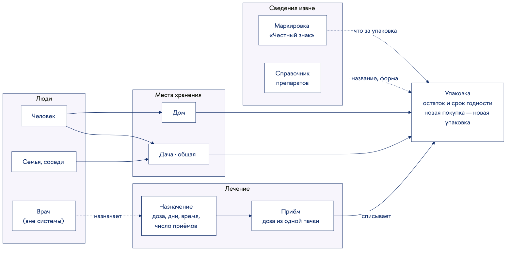
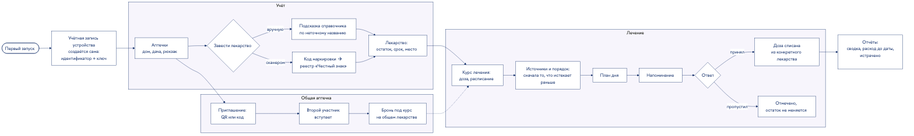
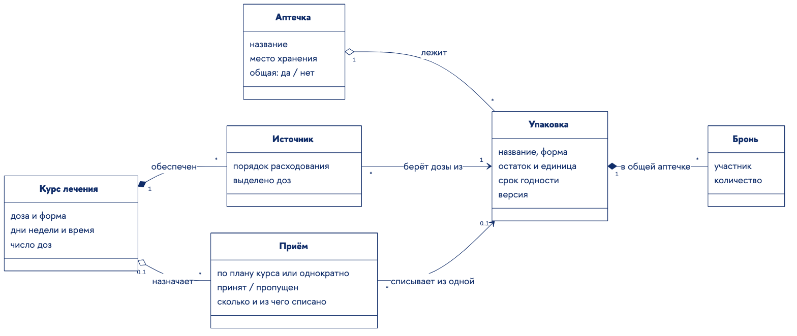
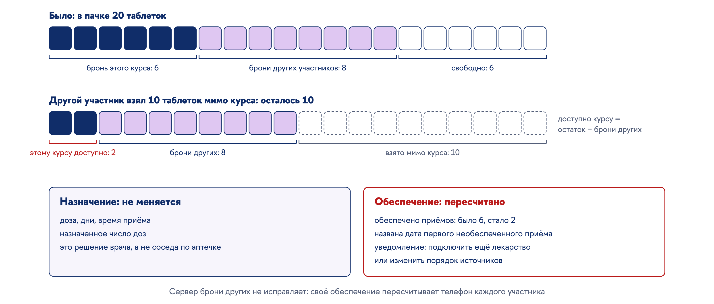
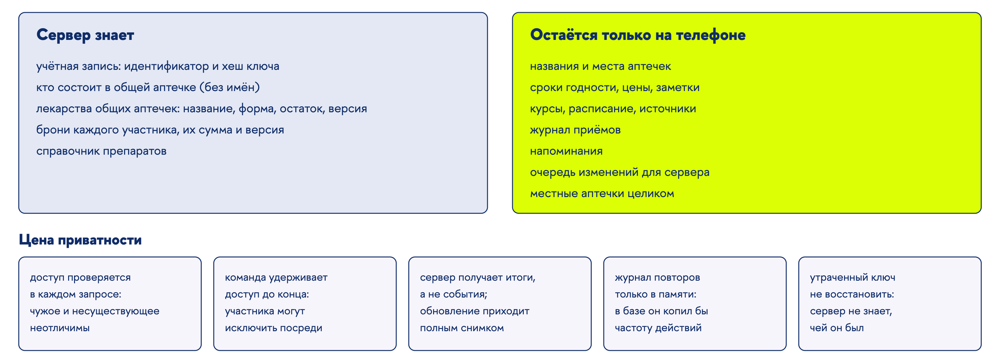
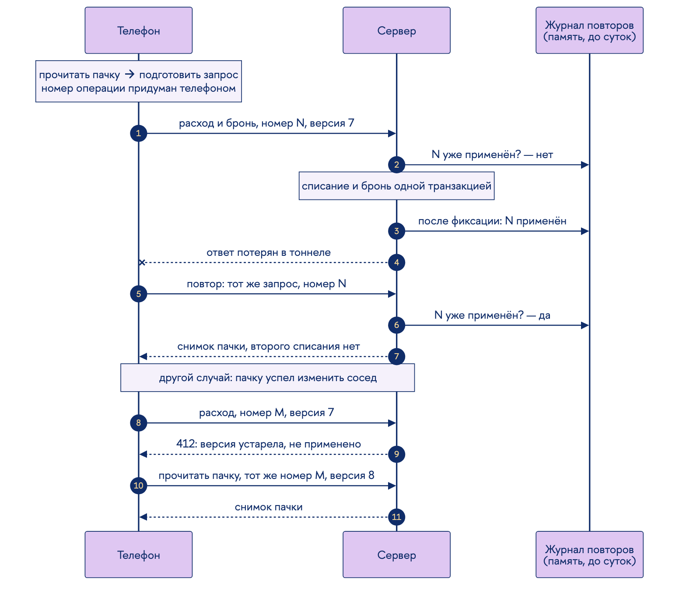
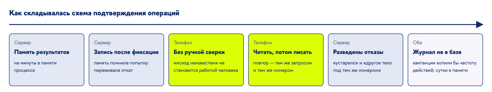
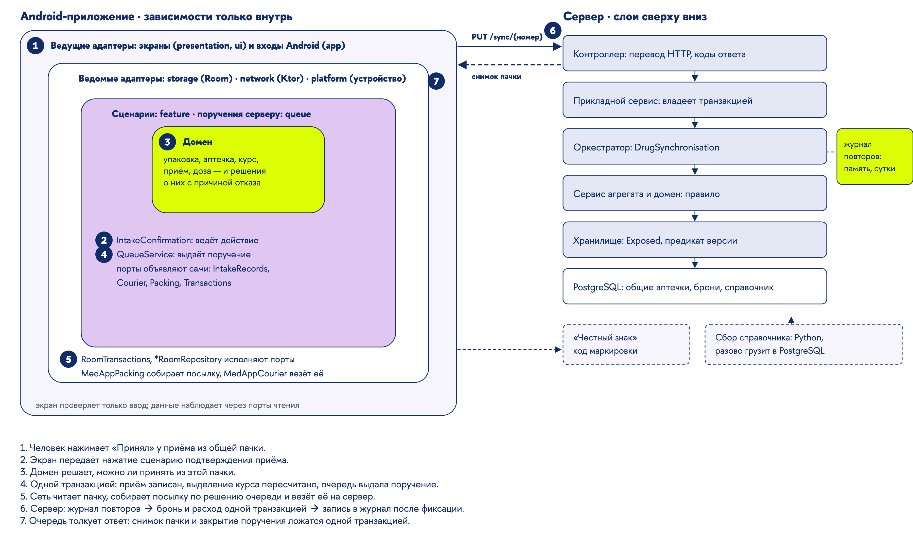
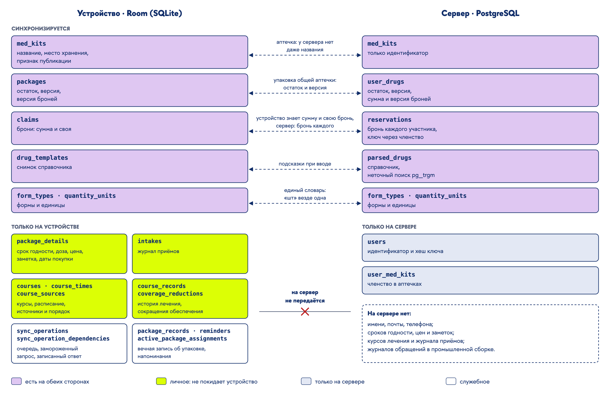

# Текст выступления к защите: полный вариант

**Проект:** Приложение для Android «Органайзер лекарств» (MedApp)

Полный текст: всё, что стоит сказать, связной речью и без ограничения по времени. Регламентный
вариант собирается из него позже. После речи каждого раздела идёт блок «На слайде»: какая
информация там видна и в какой форме. Пометка *(показывается)* означает, что материал виден на
слайде, но не проговаривается.

Разделы идут по пунктам методички. Пункты 7–9 названы по тому, что разработано в проекте, как это
сделано в примерах прошлых лет.

Линия рассказа одна: лекарства дома устроены определённым образом → из этого вырастают проблемы →
существующие приложения их закрывают по частям → требования, среди которых главным оказалась
приватность → модель учёта и лечения → как общий запас согласуется, когда сервер ничего не знает о
людях → на чём это построено → чем проверено → как это выглядит в работе. Каждая мысль
договаривается в своём разделе и дальше не пересказывается.

---

## 1. Титульный слайд (п. 1)

Добрый день. Тема индивидуального программного проекта: приложение для Android «Органайзер
лекарств». Работу выполнил студент группы БПИ245 Никита Волошин, научный руководитель: кандидат
экономических наук, доцент департамента программной инженерии Елена Юрьевна Песоцкая.

**На слайде.**
- «Приложение для Android „Органайзер лекарств“» и “Medicine Organizer” Android Application.
- Индивидуальный, программный.
- Волошин Никита, БПИ245.
- Руководитель: Е. Ю. Песоцкая, к. э. н., доцент департамента программной инженерии ФКН НИУ ВШЭ.

---

## 2. Предметная область (п. 2)

Начать стоит с того, как устроены лекарства в обычном доме, ещё до всякой программы.

Домашний запас лекарств состоит не из «лекарств вообще», а из конкретных упаковок. У каждой пачки
свой остаток и свой срок годности, и две пачки одного препарата почти никогда не совпадают ни в
том, ни в другом. Купленная пачка не пополняется: новая покупка означает новую упаковку.

Хранятся упаковки в нескольких местах: дома, на даче, на работе, в сумке. И пользуется ими, как
правило, не один человек. Домашняя аптечка обычно общая для семьи, а на даче бывает общей с
соседями. Одну пачку открывает тот, кому она сейчас нужна.

Вторая сторона области связана с лечением. Лечение назначает врач: доза, дни, время приёма и
сколько всего приёмов. Курс длится неделями, и одной пачки на него часто не хватает, поэтому он
растягивается на несколько упаковок, иногда из разных мест. Каждый приём берёт дозу из какой-то
одной конкретной пачки, а приём, который не состоялся, никакой пачки не касается.

И наконец, сведения о самих препаратах существуют вне дома. Лекарства в России маркируются кодом
системы «Честный знак», и по нему можно узнать, что это за упаковка. Названия, формы выпуска и
производителей собирают справочники препаратов.

В этой области и работает «Органайзер лекарств»: он ведёт учёт упаковок по местам, ведёт лечение
по этим упаковкам с напоминаниями и позволяет нескольким людям пользоваться общим запасом. Лечение
он не назначает и не решает, чем заменить одно лекарство другим: решения остаются за человеком и
врачом.

Такая картина сама по себе не требует программы. Потребность появляется из того, что в ней
регулярно ломается.

**На слайде.**
- Схема предметной области: люди (человек, семья, соседи; врач вне системы) → места хранения →
  упаковки (остаток, срок) → лечение (доза, расписание, число приёмов) → приёмы из конкретной
  пачки. Сбоку два внешних источника сведений: маркировка «Честного знака» и справочник
  препаратов.
- Строка внизу: «Органайзер ведёт учёт, лечение и общий запас. Не назначает лечение».

---

## 3. Актуальность работы (п. 3)

Проблем здесь четыре, и у каждой своя природа.

Первая касается самого лечения. По данным Всемирной организации здравоохранения, около половины
пациентов с хроническими заболеваниями принимают лекарства не так, как назначил врач. Одной из
самых частых причин называют забывчивость: человек пропускает приём, путает дозу или не успевает
вовремя пополнить запас.

Вторая связана с тем, что аптечка общая. По данным опросов, в подавляющем большинстве российских
домохозяйств есть общая домашняя аптечка. Остаток в ней меняется незаметно для каждого отдельного
человека, и лекарство, на которое рассчитано чьё-то лечение, забирает другой член семьи. Узнают
об этом, когда пачка уже пуста, а курс не окончен.

Третья связана с тем, что мест хранения несколько. Без записи неизвестно, что лежит дома, а что на
даче, поэтому лекарства покупают повторно или едут за тем, чего на месте не оказалось. А лечение,
растянутое по разным местам, пропускают чаще.

Четвёртая проблема: сроки годности. Просроченную пачку замечают поздно и либо выбрасывают, хотя её
можно было использовать раньше, либо принимают, не заметив срока.

Каждая из этих проблем бытовая, но вместе они означают, что учёт, лечение и общий запас держатся в
памяти нескольких людей одновременно. Отсюда цель работы.

**На слайде.**
- Четыре карточки проблем, у каждой одна строка сути: «Лечение срывается: половина пациентов
  принимает не так, как назначено»; «Общий запас тратят другие»; «Запас рассредоточен»; «Сроки
  годности замечают поздно».
- Сноски *(показывается)*: ВОЗ, «Adherence to long-term therapies», 2003; опросы ФОМ и Remedium
  о домашней аптечке.

---

## 4. Цель и задачи работы (п. 4)

Цель работы: разработать приложение для Android, которое ведёт учёт домашних лекарств и лечение
по ним и позволяет нескольким людям согласованно пользоваться общим запасом, не передавая о себе
персональных данных.

Задачи вытекают из цели. Сначала нужно понять область и то, что в ней уже есть, и сформулировать
требования. Затем построить модель учёта и лечения и разработать способ согласования общего
запаса. Для общего запаса нужен сервер, а для быстрого ввода нужен справочник препаратов, который
пришлось собрать самостоятельно. И только после этого пишется само приложение и проводятся
испытания.

**На слайде.**
Цель и задачи:
1. Проанализировать предметную область и существующие решения.
2. Сформулировать требования к программе.
3. Разработать модель учёта упаковок и лечения по ним.
4. Разработать способ согласования общего запаса при приватности по умолчанию.
5. Собрать справочник препаратов и разработать сервер общих аптечек.
6. Разработать Android-приложение.
7. Провести испытания.

---

## 5. Существующие решения (п. 5)

Среди существующих приложений ближе всего к этой области «Домашняя аптечка» с открытым исходным
кодом. Поэтому она разобрана подробно, и не по описанию в магазине, а по исходному коду.

«Домашняя аптечка» ведёт список лекарств с остатком и сроком годности, напоминает о приёме и о
конце срока, и умеет заводить лекарство сканированием кода маркировки: она обращается к тому же
сервису «Честного знака», что и эта работа. Приём списывает дозу из остатка. Однако курс приёма в
ней привязан к одной пачке: кончилась пачка, кончился и курс. «Аптечки» в ней на деле группы: одно
лекарство может входить в несколько групп сразу, поэтому места хранения они не описывают.
Справочника для ручного ввода нет: при вводе вручную все поля заполняет человек. Облачная
синхронизация устроена как копия всей базы одним файлом на Яндекс.Диске. Если двое пользуются
одним диском, побеждает тот, кто сохранил позже, а изменения второго пропадают. Общего запаса,
который расходуют несколько человек, в ней нет.

Зарубежные приложения, Medisafe и MyTherapy, сильны в напоминаниях и ведут счёт таблеток для
пополнения. У них есть семейные профили, но у каждого профиля свой список лекарств. Сроков
годности и маркировки они не знают и требуют учётную запись. «Аптечка. Учёт медикаментов» ведёт
несколько аптечек и сроки, но тоже без общего запаса.

Вывод из сравнения такой. Учёт остатка, сроки и напоминания есть почти везде, и по ним программа
ничего принципиально нового не предлагает. Нет двух вещей: курса, который берёт дозы из нескольких
упаковок в заданном порядке, и общего запаса, который несколько человек расходуют со своих
телефонов так, что лечение каждого остаётся обеспеченным.

Из этого и складываются требования.

**На слайде.**
- Таблица *(показывается; в речи только вывод)*:

| Возможность | «Домашняя аптечка» (pewaru-333) | Medisafe | MyTherapy | «Аптечка. Учёт медикаментов» | MedApp |
|---|---|---|---|---|---|
| Напоминания о приёме | + | + | + | + | + |
| Остаток списывается приёмом | + | + | + | + | + |
| Места хранения | группы, не места | – | – | + | + |
| Сроки годности | + | – | – | + | + |
| Код маркировки | + | – | – | + | + |
| Справочник для ручного ввода | – | – | – | – | + |
| Курс из нескольких упаковок | – | – | – | – | + |
| Общий запас нескольких людей | – (копия базы файлом) | – | – | – | + |
| Бронь запаса под курс | – | – | – | – | + |
| Без учётной записи | + | – | – | – | + |

- Подпись: «„Домашняя аптечка“ по исходному коду; остальные по описаниям в магазинах приложений,
  сентябрь 2026 г.».

---

## 6. Требования к программе (п. 6)

Требования удобно разделить так: что программа умеет на самом устройстве и что к этому добавляет
сеть. Причём сетей у программы три, и у каждой своя роль.

На устройстве две группы.

Первая группа: аптечки и упаковки. Аптечек сколько угодно, у каждой своё место хранения. Упаковка
заводится как отдельная единица с названием, количеством в своей единице, формой и сроком
годности. Её можно пересчитать, перенести в другую аптечку, выбросить. Просроченная упаковка
выделяется и остаётся на месте, пока человек сам её не уберёт. Поиск, фильтр и сортировка работают
и в одной аптечке, и по всем сразу, в любом порядке.

Вторая группа: лечение. Курс задаётся дозой, днями, временем и числом приёмов и берёт дозы из
выбранных упаковок в заданном порядке. В назначенное время приходит напоминание. Ответ на него, в
том числе прямо из уведомления, записывает приём и списывает дозу из конкретной пачки. Можно
принять лекарство и вне курса. Если запаса на курс не хватает, программа сообщает об этом заранее,
а правка курса не переписывает уже состоявшиеся приёмы.

Остальное добавляет сеть.

Первая сеть: собственный сервер общих аптечек. Аптечку можно сделать общей, пригласить в неё
человека кодом или QR-кодом, и тогда её упаковками пользуются несколько человек со своих
телефонов, а курс каждого закрепляет за собой часть общего запаса. Работать при этом можно и без
связи: сделанное записывается сразу и уезжает на сервер, когда связь появится.

Вторая сеть: справочник препаратов. Его программа тоже получает от собственного сервера, но
данные в нём собраны отдельной программой со справочника Vidal. При вводе названия справочник
ищет препарат по неточному совпадению, и выбор заполняет известные поля.

Третья сеть: сервис «Честного знака». Код маркировки на пачке считывается камерой, и сведения
из реестра заполняют форму упаковки.

Поверх этих групп стоят требования ко всей программе. Она не должна аварийно завершаться ни при
каком вводе и ни при каком сбое сети. Напоминания должны приходить вовремя, несмотря на
перезагрузку телефона и режимы энергосбережения.

И ещё одно требование, которое оказалось главным. В техническом задании оно звучало скромно:
сервер не хранит имён, почты и телефонов, а учётная запись создаётся автоматически. Там же
предполагалось, что сервер хранит курсы лечения участников общей аптечки и сам разрешает
конфликты, равномерно сокращая их приёмы. В ходе работы требование выросло до приватности по
умолчанию: на сервер не уходит ничего, из чего восстанавливается жизнь человека. Ни курсов, ни
приёмов, ни сроков годности, ни названий аптечек, ни единой даты. О человеке сервер знает только
идентификатор и хеш ключа, которые придумало его устройство. Причина простая: по журналу приёмов
восстанавливаются распорядок дня и характер болезни, а на домашнем сервере с несколькими
участниками даже частота действий почти персональна.

Это требование ни одна функция не видит напрямую, но оно определило устройство всей системы:
модель лечения на телефоне, то, кто разрешает конфликты, и то, как подтверждаются операции.
Об этом следующие два раздела.

**На слайде.**
- Две колонки. «На устройстве»: аптечки и упаковки; лечение. «Что добавляет сеть»: общая
  аптечка (свой сервер); справочник (свой API, данные собраны со справочника Vidal); маркировка
  (API «Честного знака»). Под колонками строка «Для всей программы»: надёжность, напоминания
  вовремя, приватность по умолчанию (выделена).
- Отдельным слайдом *(показывается)* формальный перечень с пунктами ТЗ:

| № | Требование | Пункт ТЗ |
|---|---|---|
| ФТ-1 | Аптечки: создание, место хранения, переименование, удаление с переносом или уничтожением содержимого | 4.1.1.2 |
| ФТ-2 | Упаковка: обязательные и необязательные сведения, пересчёт, перенос, удаление | 4.1.1.1, 4.1.1.3 |
| ФТ-3 | Просроченная упаковка выделяется, остаётся до решения человека, о сроке приходит уведомление | 4.1.1.5 |
| ФТ-4 | Поиск по аптечке и по всем аптечкам, фильтр и сортировка в любом порядке | 4.1.1.6–4.1.1.9 |
| ФТ-5 | Курс: доза, дни, время, число приёмов, источники и порядок расходования; правка без изменения прошлого | 4.1.1.4.4 |
| ФТ-6 | Напоминание и ответ на приём, в том числе из уведомления; ответ списывает из конкретной упаковки | 4.1.1.4.4.6–7 |
| ФТ-7 | Разовый приём вне курса | 4.1.1.4.3 |
| ФТ-8 | Нехватка запаса на курс сообщается заранее | 4.1.1.4.4.5, 4.1.1.13 |
| ФТ-9 | Общая аптечка: приглашение QR или кодом, общий остаток, бронь под курс | 4.1.1.11 |
| ФТ-10 | Справочник препаратов РФ и подсказка по неточному названию | 4.1.1.3.1, 4.1.1.12 |
| ФТ-11 | Заведение упаковки по коду маркировки через API «Честного знака» | 4.1.1.3.2 |
| ФТ-12 | Отчёты: остаток сейчас, расход до даты, истраченное за период, план на дату | 4.1.1.10 |
| НФТ-1 | Работа без связи; изменения общих аптечек уходят при появлении связи | 3.2.3 |
| НФТ-2 | Нет персональных данных: учётную запись создаёт устройство | 4.6.4 |
| НФТ-3 | Нет аварийного завершения при любом вводе и сбоях сети | 4.3 |

- Отдельным слайдом компактная схема сценария работы: завести упаковку (вручную или кодом) →
  назначить курс и источники → напоминание и ответ; ниже вторая строка: сделать аптечку общей →
  пригласить → курс участника бронирует часть запаса.

---

## 7. Модель учёта и лечения (пп. 7–8)

Первое, что пришлось решить: что именно программа учитывает. Проще всего было бы учитывать
«лекарство», но это понятие не определяется однозначно. Одно действующее вещество, одно торговое
название, одна дозировка и один производитель дают разные ответы на вопрос, что такое «одно
лекарство», и ни один из них не позволяет вести сроки годности. Поэтому единица учёта самая узкая:
конкретная упаковка. Пополнить её нельзя, новая покупка заводится новой упаковкой. Когда пачка
кончилась или выброшена, её больше нет в аптечке, но запись о ней остаётся: на неё опирается
история приёмов, и врачу можно показать, что и из какой пачки принималось.

Второе решение касается лечения. В техническом задании курс был привязан к одной пачке, так же
как у «Домашней аптечки». Но лечение принадлежит человеку, а не пачке, поэтому назначение
записывается отдельно: доза с единицей, форма, расписание и число приёмов. Пачка для этого не
нужна. Назначение можно записать ещё у врача, как черновик, а упаковку подключить, когда её
купят. Курс при этом определяется не окном дат, а числом приёмов с даты начала: пропущенный приём
не съедает дозу, а сдвигает конец лечения. Изменение назначения, например новая доза, остаётся
тем же лечением: прошлые приёмы не переписываются, перестраиваются только будущие.

Третье решение: откуда курс берёт дозы. У курса есть источники, то есть упаковки, и порядок их
расходования. Порядок задаёт человек, например чтобы сначала допить начатую пачку, пока она годна.
Доза берётся из одной упаковки и между пачками не делится, а одна упаковка служит только одному
идущему курсу человека. Из каждого источника курсу выделено определённое число доз, и выделение
считается именно в целых дозах, а не в таблетках. Причина видна на примере: доза две таблетки, в
двух пачках осталось по одной. В таблетках выделение сошлось бы с потребностью, хотя ни одной дозы
из этих пачек взять нельзя, и человек оказался бы в тупике. В дозах честно выходит ноль.

Из выделения и остатков вычисляется обеспечение курса: сколько предстоящих приёмов покрыто и с
какой даты начинается нехватка. Обеспечение не хранится, а пересчитывается при каждом изменении
запаса. И здесь было принято решение, которое расходится с техническим заданием. ТЗ требовало при
нехватке сокращать приёмы. Но расписание определил врач, и уменьшение запаса не должно его
переписывать. Поэтому при нехватке сокращается обеспечение, а не назначение: доза, дни, время и
число приёмов остаются прежними, а человек получает уведомление, с какого дня лекарства не хватит,
и оттуда же может подключить ещё одну упаковку.

Теперь о том, что меняется, когда упаковка общая. На одной пачке сходятся курсы разных людей, и
каждому нужно знать, сколько из неё можно обещать себе. Для этого из остатка вычитаются брони
других участников: получается то, что доступно этому человеку. Если вычесть ещё и его собственное
выделение, получается свободный остаток. Бронь на сервере и есть невыбранное выделение источника:
курс выделил себе шесть доз, приняли одну, бронь уменьшилась на одну. Выделить себе больше, чем
доступно, нельзя, поэтому одну и ту же часть пачки невозможно пообещать двоим. Если человек хочет
принять лекарство вне курса и тем задевает чужую бронь, программа сначала спрашивает и называет,
сколько свободно. Когда пачку переносят в аптечку, которую видят не все, бронь сохраняется только
у тех, кто её видит. А когда человек выходит из общей аптечки, его курс и история приёмов
остаются при нём, теряются только источники из этой аптечки.

Вся эта модель живёт на телефоне. Остаётся вопрос, как несколько телефонов договариваются об
одной пачке, если сервер, по требованию приватности, не знает ни одного курса.

**На слайде.**
- Модель предметной области: аптечка → упаковка (и вечная запись о ней); курс = назначение +
  источники в порядке с выделением в дозах; приём берёт дозу из одной упаковки; бронь =
  невыбранное выделение источника на общей упаковке.

- Что изменилось относительно ТЗ *(показывается)*: курс привязан к пачке → назначение без пачки,
  источники в порядке; нехватка сокращает приёмы → нехватка сокращает обеспечение; при выходе из
  аптечки курсы аннулируются → курс и история остаются.
- Пример на одной пачке: в пачке 20 таблеток, бронь этого курса 6, брони других 8, свободно 6.
  Другой участник взял 10 → этому курсу доступно 2, обеспечение сократилось, назначение прежнее.

---

## 8. Приватность по умолчанию и подтверждение операций (п. 9)

Сервер знает об общей аптечке ровно то, без чего она невозможна: кто в ней состоит, какие в ней
упаковки с общими сведениями, сколько в каждой осталось и сколько из неё забронировано и кем. Всё
остальное, то есть лечение, приёмы, сроки, цены и названия аптечек, остаётся на телефоне. Из
этого разделения следуют три вещи, и каждая оказалась сложнее, чем выглядела.

Первое следствие: сервер не может разрешать конфликты. Техническое задание отводило ему именно
эту роль, но сократить чей-то курс можно, только зная этот курс, а сервер его не знает. Поэтому
бронь для сервера всего лишь заявка владельца. Сервер её хранит и складывает брони на каждой
пачке, но не сверяет с остатком и не исправляет: тридцать таблеток в пачке при сорока
забронированных для него допустимое состояние. Отказывает он только расходу больше остатка,
потому что это уже физика. Чужую бронь стережёт клиент: план берёт только доступное, а приём
сверх свободного спрашивает. А когда запас уменьшился, каждый телефон сам пересчитывает
обеспечение своих курсов и сам отправляет новую бронь. Что сервер действительно принимает бронь
сверх свободного, проверено не рассуждением, а пробой против боевого сервера.

Второе следствие: сервер не получает событий, а получает итог. Телефон присылает, сколько
израсходовано из пачки, и какой теперь стала бронь, одним запросом на упаковку. Расход передаётся
приращением, потому что приращения складываются в любом порядке. Бронь передаётся абсолютным
значением, потому что это решение владельца. Если бы это были два отдельных запроса, списание
могло бы прийти раньше уменьшения брони, и все участники на мгновение увидели бы, что лекарства не
хватает.

Третье следствие самое трудное: подтверждение операций. Представим, что человек отметил приём в
метро. Запрос до сервера дошёл, расход применился, а ответ потерялся в тоннеле. Телефон не знает,
чем кончилось дело. Повторит запрос, и доза может списаться дважды. Не повторит, и приём может не
попасть на сервер вовсе. Чтобы повтор был безопасен, сервер должен помнить, какие операции он уже
применил. Но память о действиях человека и есть то, что сервер хранить не должен.

Схема, которая эту задачу решает, складывалась долго, и каждый шаг исправлял найденную ошибку.
Сначала сервер помнил результаты операций несколько минут в памяти процесса. Затем выяснилось,
что память помнит попытку, а не результат: запись в неё шла по ходу команды и переживала откат
транзакции, так что повтор получал подтверждение того, чего в базе нет. Запись перенесли на
момент после фиксации транзакции. На телефоне сначала было состояние «исход неизвестен до ручной
сверки», от которого отказались: неопределённость не должна становиться работой человека. Потом
повтор уходил замороженным запросом по давней версии упаковки, и применённый расход закрывался
как отказ. Итоговое правило на телефоне такое: перед отправкой прочитать пачку, подготовить запрос
по свежему состоянию, повторять только тем же запросом и под тем же номером. Отказ по устаревшей
версии означает «не применилось», и тогда запрос готовится заново под тем же номером, а меняются в
нём только версии. Сервер со своей стороны развёл причины отказов: устаревшая версия отвечает
одним кодом, а тот же номер с другим содержимым, то есть ошибка клиента, другим. Разовый приём
тоже получил номер, который придумывает телефон.

Последним стоял вопрос, где держать эту память. Надёжнее всего была бы таблица квитанций в базе.
Её предлагали и сознательно отвергли: даже обезличенная таблица копила бы частоту действий
человека, а это почти тот же журнал приёмов. Поэтому журнал повторов живёт в памяти сервера не
дольше суток. Остаток риска назван и принят: если телефон провёл без связи больше суток, сервер за
это время перезапустился, а пачку изменил кто-то другой, повтор может не узнать свою операцию.
Такое расхождение не прячется: человек видит его на экране синхронизации, а исправляется оно
пересчётом пачки. Ниже нуля сервер не списывает никогда.

Тот же принцип распространяется и на создание. Номера новых аптечек и упаковок, а также логин и
ключ учётной записи придумывает телефон и сохраняет до отправки. Поэтому потерянный ответ на
создание ничего не теряет: повтор узнаётся как «уже есть», а не как вторая аптечка или вторая
учётная запись.

Человеку из всего этого видно немногое. Отказ по версии он не видит вовсе: телефон перечитывает
пачку и отправляет заново сам. Отказ по существу, например «на сервере осталось меньше, чем вы
списали», стоит на экране синхронизации своей фразой и ведёт к пересчёту.

**На слайде.**
- Две колонки «Что знает сервер» / «Что остаётся на телефоне». Под ними три следствия одной
  строкой каждое: «конфликт решает телефон, бронь — заявка»; «итог вместо событий»;
  «подтверждение без журнала в базе».

- Диаграмма последовательности: приём в метро, ответ потерян → повтор тем же запросом → ответ из
  журнала повторов, второго списания нет; рядом вторая ветка: чужое изменение → отказ по версии →
  чтение → тот же номер со свежей версией.

- Короткая лента «как складывалась схема» *(показывается)*: память на минуты → запись после
  фиксации → отказ от ручной сверки → «прочитать, потом писать», тот же номер → разведённые коды
  отказов → журнал в базе отвергнут, сутки в памяти.

---

## 9. Архитектура (п. 10)

Система состоит из трёх программ. Android-приложение хранит всё личное и ведёт лечение. Сервер
хранит общие аптечки и справочник. Отдельная программа собирает справочник и загружает его в базу
сервера, а в работе приложения не участвует.

Приложение построено по принципам Clean Architecture: зависимости в исходном коде направлены
только внутрь, к предметной области. В центре домен: упаковка, аптечка, курс, приём и решения о
них. Вокруг него сценарии, то есть целые действия человека или системы, и очередь поручений
серверу. Снаружи адаптеры: хранение, сеть и функции устройства. Самый внешний слой составляют
экраны и входы Android. Главное правило: порт, то есть интерфейс, объявляет тот, кому он нужен, а
исполняет тот, кто умеет. Поэтому очередь, которой надо отвезти поручение на сервер, сама
объявляет «курьера», а исполняет его сетевой слой: вызов идёт наружу, а зависимость внутрь.
Решает всегда домен, сценарий только ведёт, а экран проверяет лишь ввод. Эти границы проверяются
автоматически по графу импортов, и изменение, которое их нарушает, в основную ветку не попадает.

Сервер устроен слоями сверху вниз: контроллер переводит HTTP, прикладной сервис владеет
транзакцией, оркестратор ведёт сценарий из нескольких агрегатов, сервис агрегата применяет правило
домена, хранилище пишет в базу. Доступ выражен в самом чтении: запрос принимает вызывающего, и
чужое для сервера неотличимо от несуществующего.

Как это работает вместе, лучше показать на одной операции: человек нажимает «Принял» у приёма из
общей пачки. Экран передаёт нажатие сценарию подтверждения приёма. Сценарий спрашивает домен,
можно ли принять из этой пачки, и одной транзакцией записывает приём, пересчитывает выделение
курса и получает от очереди поручение серверу. Очередь берёт поручение, сеть читает пачку с
сервера, собирает запрос и отправляет его. На сервере контроллер принимает запрос синхронизации,
прикладной сервис открывает транзакцию, оркестратор синхронизации проверяет журнал повторов,
применяет бронь и расход, хранилище пишет их с проверкой версии, и после фиксации операция
попадает в журнал. Ответом приходит свежий снимок пачки. Очередь толкует его, и одной транзакцией
на телефоне ложатся снимок и закрытие поручения. Экран, который наблюдает данные, показывает число
с сервера.

**На слайде.**
- Одна схема: слева приложение кольцами (в центре домен; сценарии и очередь; адаптеры хранения,
  сети и устройства; экраны и входы Android), справа сервер слоями, снизу внешние сервисы:
  реестр «Честного знака» и программа сбора справочника. Поверх схемы нумерованный путь
  операции «Принял».

---

## 10. Средства реализации (п. 11)

Средства выбирались под эти требования.

Обе части написаны на Kotlin: Google развивает Android в первую очередь для Kotlin, а один язык на
телефоне и сервере позволяет одинаково описывать данные. Интерфейс построен на Jetpack Compose и
Material 3. Room выбран основным хранилищем, а не кэшем: без сети программа работает на нём
целиком. Напоминания держатся на будильниках системы и WorkManager, чтобы переживать перезагрузку
и энергосбережение. Коды распознаёт ML Kit вместе с CameraX: он сам сообщает формат кода, поэтому
код маркировки и QR приглашения различаются распознавателем, а не догадкой по длине строки.
Библиотека ZXing, у которой режим поддержки, в проекте тоже есть, но только для того, чтобы
нарисовать QR приглашения.

Сервер построен на Spring Boot. Сначала рассматривался Ktor, но его документация отрывочна, а
у Spring зрелая экосистема. База данных сервера PostgreSQL: она надёжна и умеет искать препарат
по неточному названию через триграммный индекс.

Отдельно стоит сказать о доступе к базе. Сначала использовались JPA и Hibernate, стандартные для
Spring, и от них пришлось отказаться в пользу Exposed, где запросы пишутся явно. В этой программе
форма запроса сама стала требованием: в ней выражены доступ вызывающего, проверка версии и то,
что число запросов не растёт вместе с числом упаковок. Hibernate строит запросы сам и прячет всё
это, и его поведение приходилось переопределять почти на каждом шаге. Кроме того, он требует
изменяемых сущностей, а на Kotlin данные принято описывать неизменяемыми. Переход на Exposed
сразу вскрыл ошибку в порядке операций при переносе упаковки, которую Hibernate до этого скрывал.

Сервер проверяется на настоящем PostgreSQL в Testcontainers: поведение блокировок и версий зависит
от конкретной СУБД. Справочник собран программой на Python с сайта Vidal.

И одна деталь о внешнем сервисе. API «Честного знака» не документирован. Формат запроса прочитан
по открытому коду той самой «Домашней аптечки», при этом её код не копировался.

**На слайде** *(показывается; подробно только Exposed)*.

| Средство | Компания | Зачем |
|---|---|---|
| Kotlin | JetBrains | один язык на телефоне и сервере |
| Jetpack Compose, Material 3 | Google | интерфейс |
| Room | Google | основное хранилище на телефоне |
| Hilt | Google | сборка зависимостей |
| WorkManager, AlarmManager | Google | напоминания и фоновая синхронизация |
| CameraX, ML Kit | Google | распознавание кодов с форматом |
| ZXing | ZXing Authors | рисование QR приглашения |
| Ktor Client | JetBrains | обмен с сервером и с «Честным знаком» |
| Spring Boot, Spring Security | Broadcom (VMware Tanzu) | сервер, зрелая экосистема |
| Exposed | JetBrains | явные запросы вместо ORM |
| PostgreSQL, pg_trgm | PostgreSQL Global Development Group | база сервера, неточный поиск |
| Testcontainers, Docker | AtomicJar, Docker Inc. | проверки на настоящей базе, развёртывание |
| Python: requests, BeautifulSoup, SQLAlchemy | Python Software Foundation и сообщество | сбор справочника |

---

## 11. Особенности реализации: базы данных и испытания (п. 12)

Баз в системе две: на телефоне и на сервере. Их схема повторяет разделение из раздела 8, и
приватность в ней видна буквально. Общих понятий немного: аптечка, упаковка, брони, словарь форм
и единиц. Но даже общее хранится по-разному. У аптечки на сервере нет названия, только
идентификатор. У упаковки на сервере нет срока годности, цены и заметки. Курсов, приёмов и
напоминаний на сервере нет совсем. Зато только на сервере есть членство в аптечках и брони каждого
участника по отдельности: телефон знает сумму чужих броней и свою. Ограничения записаны в саму
схему, а не оставлены коду. На сервере бронь ссылается на членство, поэтому брони без доступа к
аптечке существовать не может. На телефоне упаковка может быть назначена только одному идущему
курсу. Схема сервера описана в одном месте, и файл для развёртывания порождается из того же
описания, по которому поднимаются испытания.

Испытания построены так, чтобы каждый вид проверки ловил свой класс ошибок, и у каждого вида
есть найденный им дефект.

Гонки на сервере проверяются настоящими параллельными транзакциями. Одна из таких проверок, как
выяснилось, проходила случайно: барьер стоял так, что быстрая сторона успевала всё сделать, пока
медленная только читала. Проверку переписали.

Число запросов к базе зафиксировано проверкой: оно не должно расти с объёмом. Так нашлось
удаление аптечки, которое делало отдельный запрос на каждую упаковку.

Планы запросов проверяются на большой выборке, потому что на маленькой таблице база всегда читает
её целиком и не видно, работает ли индекс. Так нашёлся поиск по справочнику, который читал
справочник целиком.

Архитектурные правила на обеих сторонах проверяются по коду, и у каждого правила есть пример
нарушения, на котором оно обязано упасть. Одно из ранних правил, как оказалось, не могло упасть ни
при каком нарушении, и его сняли.

Пробы против боевого сервера проверяют, что сервер ведёт себя так, как на него рассчитывает
приложение. Именно проба установила, что бронь для сервера заявка, а не замок, и что чужую бронь
должен стеречь клиент.

Истории людей проходят путь человека целиком, через несколько экранов и несколько дней. Ошибки,
которые живут между экранами, находились именно ими: поле даты, до которого нельзя было дотянуться
пальцем, и пропущенный приём, который выглядел так же, как неотвеченный.

Интерфейс проверяется на старом Android с маленьким экраном, на новом с крупным шрифтом и на
английском языке. А каждое изменение перед включением в основную ветку проходило рецензирование.

**На слайде.**
- Общая схема двух баз: слева телефон, справа сервер, парные таблицы напротив друг друга;
  личное выделено; перечень того, чего на сервере нет.

- Таблица «вид проверки → что ловит → что нашла» *(показывается)*:

| Вид проверки | Что ловит | Что нашла |
|---|---|---|
| Параллельные транзакции | затирание чужого изменения | проверку гонки, проходившую случайно |
| Число запросов | запрос на каждую упаковку | удаление аптечки с запросом на каждую упаковку |
| Планы запросов на объёме | полное чтение вместо индекса | поиск, читавший справочник целиком |
| Архитектурные правила с примером нарушения | нарушение границ слоёв | правило, которое не могло упасть |
| Пробы против боевого сервера | расхождение ожиданий с сервером | бронь — заявка, а не замок |
| Истории людей | ошибки между экранами и днями | недосягаемое поле даты, пропуск как неответ |
| Три конфигурации устройства | вёрстка, шрифт, язык | — |

---

## 12. Результаты и выводы (п. 13)

Все задачи выполнены. Проанализированы предметная область и аналоги, сформулированы требования.
Разработана модель учёта упаковок и лечения по ним: курс с источниками в порядке, выделение в
дозах, обеспечение вместо сокращения назначения, бронь как невыбранное выделение. Разработан
способ согласования общего запаса, при котором сервер не знает о людях ничего, кроме
идентификатора. Собран справочник, разработаны сервер и Android-приложение, проведены испытания.

Главный вывод касается приватности. Требование, которое в техническом задании занимало одну
строку, определило устройство системы сильнее любой функции: где живёт лечение, кто разрешает
конфликты и как подтверждаются операции. Общий запас с бронью под курс, которого нет ни у одного
из аналогов, работает без учётной записи, имени и контактов.

**На слайде** *(показывается)*: задачи из п. 4 и результат по каждой.

---

## 13. Направления развития (п. 14)

Развитие ведётся задачами в репозиториях проекта. В приложении это расписания «через день» и
«каждые несколько дней», правка уже записанных ответов и просмотр прошлых дней, поиск по
справочнику без сети. На сервере это второй рубеж доступа политиками самой базы данных поверх
условия в запросах. Для продукта это публикация в магазине приложений.

**На слайде** *(показывается)*: три колонки: приложение, сервер, продукт.

---

## 14. Список использованных источников (п. 15)

Не проговаривается: слайд остаётся на экране во время вопросов.

**На слайде.** Документация средств с компаниями; описания аналогов и репозиторий
«Домашней аптечки»; ВОЗ, «Adherence to long-term therapies», 2003; опросы о домашней аптечке;
репозитории проекта.

---

## 15. Демонстрация (2:00)

Как всё это выглядит в работе, показано на телефоне. Демонстрация идёт по той же линии, что и
рассказ: учёт, лечение, общий запас.

**0:00–0:20. Учёт.** Список аптечек: дом, дача, работа. В аптечке «Дом» просроченная упаковка
выделена и стоит выше остальных.
> Учёт идёт по местам, и у каждого места свой список. Просроченное видно сразу.

**0:20–0:40. Код маркировки.** Сканер, камера на настоящую коробку. Форма открывается уже
заполненной сведениями из реестра «Честного знака»; остаётся количество и аптечка.
> Упаковка заводится по коду на пачке: название, производителя и состав приложение берёт из
> реестра.

**0:40–1:05. Лечение.** Карточка курса со строкой нехватки → источники. Подключить вторую упаковку,
перетащить её наверх, сохранить: обеспечение пересчиталось.
> Курс берёт дозы из нескольких упаковок в порядке, который задаёт человек. Нехватка названа
> заранее, а назначение врача при этом не меняется.

**1:05–1:20. Напоминание.** Уведомление в шторке, «Принял» прямо из неё; на странице дня приём
отмечен, остаток пачки уменьшился.
> Ответ из уведомления записывает приём и списывает дозу из конкретной пачки.

**1:20–1:45. Общая аптечка.** Аптечка «Дача» → «Пригласить»: QR и код. В общей упаковке видна
чужая бронь; попытка разового приёма из занятого → вопрос «заденет занятое, свободно столько-то».
> Аптечку делают общей по приглашению, без учётных записей. Чужая бронь видна, и приложение не
> даёт незаметно взять то, на что рассчитан чужой курс.

**1:45–2:00. Синхронизация.** «Опции» → «Синхронизация»: строка отказа сервера с причиной и
кнопкой пересчёта.
> Если сервер отказал по существу, человек видит причину своими словами и путь к исправлению.

Спасибо за внимание.

**Что подготовить к показу** *(не проговаривается)*: просроченная упаковка в «Доме»; курс с
нехваткой и неподключённая вторая упаковка; общая аптечка с чужой бронью со второго телефона;
отказ сервера по остатку, заработанный вторым телефоном; настоящая коробка с кодом маркировки.
